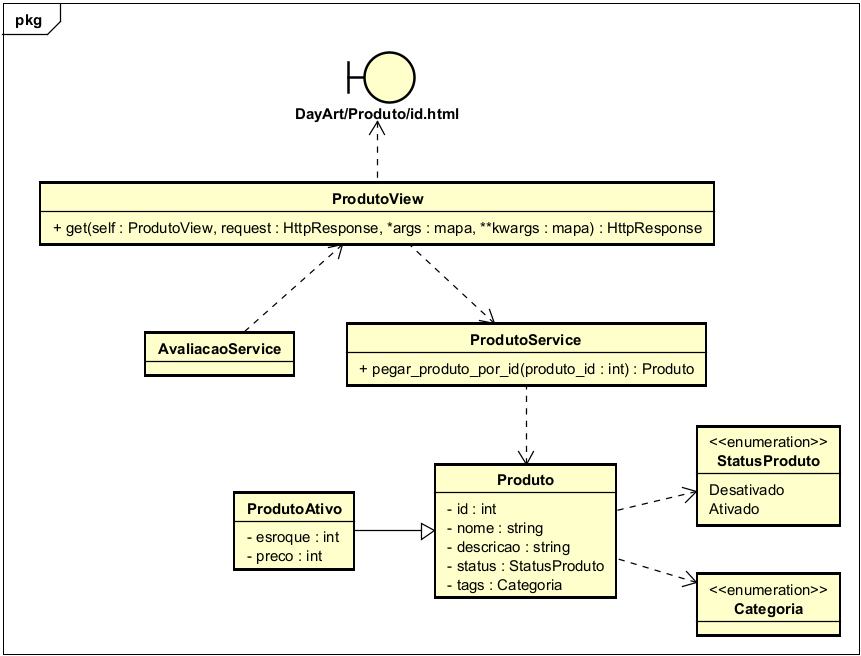

# CDU01. Página do produto

- **Ator principal**: Usuários.
- **Atores secundários**: Nenhum.
- **Resumo**: Sistema carrega a página do produto com suas informações.
- **Pré-condição**: Usuário está em uma página que exibe produtos clica em um.
- **Pós-Condição**: Sistema mostra a página do produto desejado.

## Fluxo Principal
| Ações do ator | Ações do sistema |
| :-----------------: | :-----------------: |
| 1 - Usuário clica em um produto. | | 
| | 2 - Sistema redireciona o Usuário a página de produto que possui todas suas informações especificas | 

> Obs. as seções a seguir apenas serão utilizadas na segunda unidade do PDSWeb (segundo orientações do gerente do projeto).

## Diagrama de Classes de Projeto

