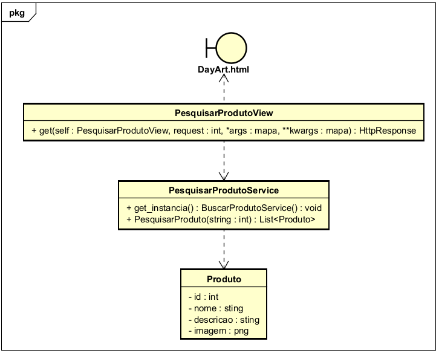

# CDU02. Pesquisar Produto

- **Ator principal**: Usuários.
- **Atores secundários**: Nenhum.
- **Resumo**: Usuários podem procurar por produtos através de uma barra de pesquisa ou por filtros.
- **Pré-condição**: Existe uma banco de dados de produtos.
- **Pós-Condição**: Sistema mostra uma lista de todos os produtos compativeis.

## Fluxo Principal
| Ações do ator | Ações do sistema |
| :-----------------: | :-----------------: | 
| 0 - Usuário digita na barra de pesquisa o nome ou a característica desejada . | |  
| 1 - Usuário clica "Enter" para realizar a busca.| |
| | 2 - Sistema processa a consulta, filtrando o banco de dados e mostrando todos os podutos similares. Mostrando o nome, imagem, descrição e se estiver a venda ou não, junto do preço e estoque . |
| 3 - Usuário clica no produto desejado para abrir sua página. | |
| |4 - Sistema redireciona o usuário para a página do produto. |

## Fluxo Alternativo - Seleção por Categoria
| Ações do ator | Ações do sistema |
| :-----------------: |:-----------------: | 
| 0.1 - O usuário seleciona a categoria desejada na header da página. | |  
| | (Retorna ao passo 2 do fluxo principal) |

> Obs. as seções a seguir apenas serão utilizadas na segunda unidade do PDSWeb (segundo orientações do gerente do projeto).

## Diagrama de Classes de Projeto

